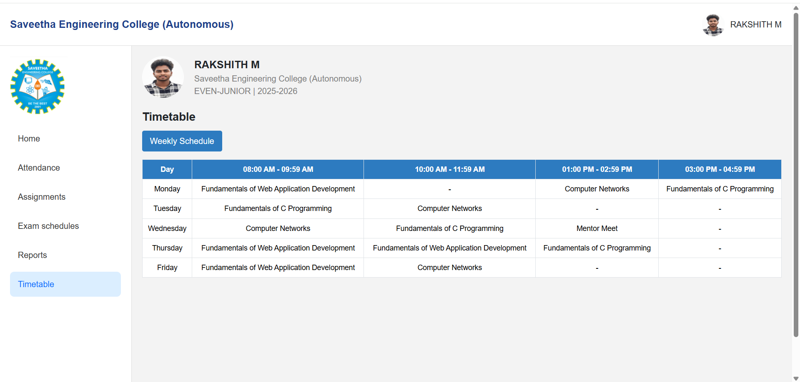

# Ex08 CAMU Schedule using Bootstrap
## Date:29-05-2026

## AIM:
To design a responsive and visually appealing CAMU Schedule using Bootstrap.

## DESIGN STEPS:
### Step 1:
Clone the repository from GitHub.

### Step 2:
Create Django Admin project.

### Step 3:
Create a New App under the Django Admin project.

### Step 4:
Add the Bootstrap CDN link inside the <head> section.

### Step 5:
Insert a table element with Bootstrap table classes.

### Step 6:
Construct the complete table.

### Step 7:
Add a header/footer displaying copyright information.

### Step 8:
Publish the website in the LocalHost.

## PROGRAM :
## Camu Schedule
```
<!DOCTYPE html>
<html lang="en">
<head>
<meta charset="UTF-8">
<meta name="viewport" content="width=device-width, initial-scale=1.0">

<title>CAMU Timetable</title>

<link href="https://cdn.jsdelivr.net/npm/bootstrap@5.3.3/dist/css/bootstrap.min.css" rel="stylesheet">


<link rel="stylesheet"
href="https://cdn.jsdelivr.net/npm/bootstrap-icons@1.11.3/font/bootstrap-icons.min.css">

<style>

body{
    margin:0;
    background:#f3f3f3;
    font-family:Arial, sans-serif;
}


.topbar{
    background:white;
    padding:18px 20px;
    border-bottom:1px solid #ddd;
}

.college-name{
    color:#1f3f8b;
    font-weight:bold;
    font-size:20px;
}

.profile{
    display:flex;
    align-items:center;
    justify-content:end;
    gap:10px;
}

.profile img{
    width:45px;
    height:45px;
    border-radius:50%;
}


.sidebar{
    background:white;
    min-height:100vh;
    border-right:1px solid #ddd;
    padding:20px;
}

.logo{
    width:110px;
    margin-bottom:20px;
}

.menu a{
    display:block;
    padding:12px 15px;
    text-decoration:none;
    color:#333;
    border-radius:8px;
    margin-bottom:8px;
    transition:0.3s;
}

.menu a:hover{
    background:#dbeeff;
}

.menu .active{
    background:#dbeeff;
    color:#0d6efd;
}


.main-content{
    padding:20px;
}


.student-box{
    display:flex;
    align-items:center;
    gap:20px;
    margin-bottom:20px;
}

.student-box img{
    width:80px;
    height:80px;
    border-radius:50%;
}

.student-name{
    font-size:20px;
    font-weight:bold;
}

.student-detail{
    color:gray;
}


.heading{
    font-size:22px;
    font-weight:bold;
    margin-bottom:10px;
}

.week-btn{
    background:#2d7bc0;
    color:white;
    border:none;
    padding:8px 15px;
    border-radius:4px;
    margin-bottom:15px;
}

/* Table */

table{
    background:white;
}

th{
    background:#2d7bc0 !important;
    color:white !important;
    text-align:center;
    font-size:14px;
}

td{
    text-align:center;
    vertical-align:middle;
    font-size:14px;
}

.table-responsive{
    overflow-x:auto;
}

@media(max-width:768px){

.sidebar{
    min-height:auto;
}

.student-box{
    flex-direction:column;
    align-items:start;
}

.profile{
    justify-content:start;
    margin-top:10px;
}

}

</style>

</head>

<body>


<div class="container-fluid topbar">

    <div class="row align-items-center">

        <div class="col-md-8">
            <div class="college-name">
                Saveetha Engineering College (Autonomous)
            </div>
        </div>

        <div class="col-md-4">

            <div class="profile">

                

                <span>RAKSHITH M</span>

            </div>

        </div>

    </div>

</div>


<div class="container-fluid">

    <div class="row">

       

        <div class="col-lg-2 sidebar">

            

            <div class="menu">

                <a href="#">Home</a>

                <a href="#">Attendance</a>

                <a href="#">Assignments</a>

                <a href="#">Exam schedules</a>

                <a href="#">Reports</a>

                <a href="#" class="active">Timetable</a>

            </div>

        </div>

        

        <div class="col-lg-10 main-content">

          

            <div class="student-box">

                

                <div>

                    <div class="student-name">
                        RAKSHITH M
                    </div>

                    <div class="student-detail">
                        Saveetha Engineering College (Autonomous)
                    </div>

                    <div class="student-detail">
                        EVEN-JUNIOR | 2025-2026
                    </div>

                </div>

            </div>

         

            <div class="heading">
                Timetable
            </div>

            <button class="week-btn">
                Weekly Schedule
            </button>

          

            <div class="table-responsive">

                <table class="table table-bordered">

                    <thead>

                        <tr>

                            <th>Day</th>

                            <th>08:00 AM - 09:59 AM</th>

                            <th>10:00 AM - 11:59 AM</th>

                            <th>01:00 PM - 02:59 PM</th>

                            <th>03:00 PM - 04:59 PM</th>

                        </tr>

                    </thead>

                    <tbody>

                        <tr>

                            <td>Monday</td>

                            <td>
                                Fundamentals of Web Application Development
                            </td>

                            <td>-</td>

                            <td>
                                Computer Networks
                            </td>

                            <td>
                                Fundamentals of C Programming
                            </td>

                        </tr>

                        <tr>

                            <td>Tuesday</td>

                            <td>
                                Fundamentals of C Programming
                            </td>

                            <td>
                                Computer Networks
                            </td>

                            <td>-</td>

                            <td>-</td>

                        </tr>

                        <tr>

                            <td>Wednesday</td>

                            <td>
                                Computer Networks
                            </td>

                            <td>
                                Fundamentals of C Programming
                            </td>

                            <td>
                                Mentor Meet
                            </td>

                            <td>-</td>

                        </tr>

                        <tr>

                            <td>Thursday</td>

                            <td>
                                Fundamentals of Web Application Development
                            </td>

                            <td>
                                Fundamentals of Web Application Development
                            </td>

                            <td>
                                Fundamentals of C Programming
                            </td>

                            <td>-</td>

                        </tr>

                        <tr>

                            <td>Friday</td>

                            <td>
                                Fundamentals of Web Application Development
                            </td>

                            <td>
                                Computer Networks
                            </td>

                            <td>-</td>

                            <td>-</td>

                        </tr>

                    </tbody>

                </table>

            </div>

        </div>

    </div>

</div>

</body>
</html>
```

## OUTPUT:


## RESULT:
A responsive and visually appealing CAMU Schedule web page using Bootstrap is designed successfully.
